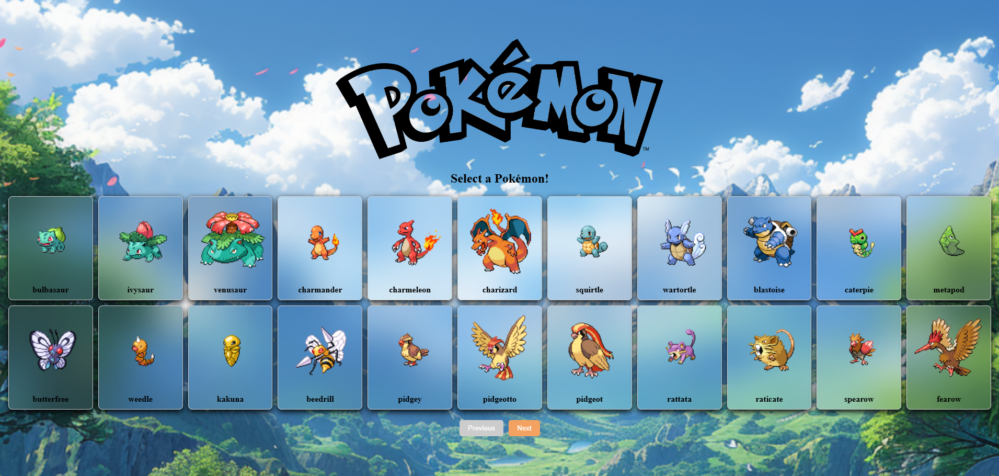

# Pokémon API Project

---

## Mockups





---

## Overview
This project is a React-based web application that fetches and displays Pokémon data from the [PokeAPI](https://pokeapi.co/about). It allows users to browse a list of Pokémon and view detailed information about individual characters.

---

## Features

*   **Homepage:** A landing page with a logo and a call-to-action button to browse Pokémon.
*   **Character List:** Displays a paginated list of Pokémon with their images and names.
*   **Character Details:** Shows detailed information about a selected Pokémon, including base experience, height, weight, and abilities.  Allows searching for a specific Pokemon by ID.
*   **Responsive Design:**  The layout adapts to different screen sizes for a better user experience.

---

## Component Breakdown

This section provides a more detailed overview of the key React components used in this project.

*   **`App.jsx`:** This is the main application component. It serves as the entry point for the entire application and is responsible for rendering the main layout. Currently, it simply renders the `CharacterList` component within a section.

*   **`HomePage.jsx`:** This component represents the landing page of the application. It displays:
    *   A Pokémon logo.
    *   A title ("Gotta Catch 'Em All!").
    *   A "Browse Pokémon" button (a `Link` component) that navigates the user to the `/browse` route, rendering the `CharacterList` component.

*   **`CharacterList.jsx`:** This component is responsible for fetching and displaying a list of Pokémon. Key functionalities include:
    *   **Data Fetching:** Uses `axios` to fetch Pokémon data from the PokeAPI, implementing pagination to load data in chunks.
    *   **State Management:** Utilizes the `useState` hook to manage the list of Pokémon, loading state, and error state.
    *   **Rendering:** Maps over the fetched Pokémon data to render a list of `Link` components, each linking to the `CharacterDetails` page for a specific Pokémon.
    *   **Pagination:** Includes "Previous" and "Next" buttons to navigate between pages of Pokémon.

*   **`CharacterDetails.jsx`:** This component displays detailed information about a single Pokémon.
    *   **Route Parameter:** Uses `useParams` from `react-router-dom` to extract the Pokémon ID from the URL.
    *   **Data Fetching:** Fetches data for the specific Pokémon from the PokeAPI using the ID.
    *   **State Management:** Uses `useState` to manage the Pokémon data, an input field for searching by ID, and any error messages.
    *   **Rendering:** Displays the Pokémon's image, name, base experience, height, weight, and abilities.
    *   **Search Functionality:** Includes an input field and a button to allow users to search for a Pokémon by ID.
    *   **Navigation:**  Uses the `useNavigate` hook from `react-router-dom` to update the route to display the selected Pokemon

---

## Technologies Used

*   **React:** A JavaScript library for building user interfaces.
*   **React Router:** A library for handling navigation and routing within the application.
*   **Axios:** A library for making HTTP requests to the PokeAPI.
*   **CSS:** For styling the application.

---

## Folder Structure
```plaintext

Oct24_Cohort_Module11_Lesson4_Assignment-1/
├── public/ 
├── src/ 
│ ├── App.jsx 
│ ├── main.jsx 
│ ├── components/ 
│ │ ├── CharacterDetails.jsx 
│ │ ├── CharacterList.jsx 
│ │ ├── HomePage.jsx 
│ ├── styles/ 
│ │ ├── characterDetails.css
│ │ ├── characterList.css
│ │ ├── homePage.css
│ │ ├── mainApp.css
│ │ └── global.css 
│ ├── index.html 
│ └── vite.config.js 
├── README.md 
├── package.json 
└── .gitignore
```